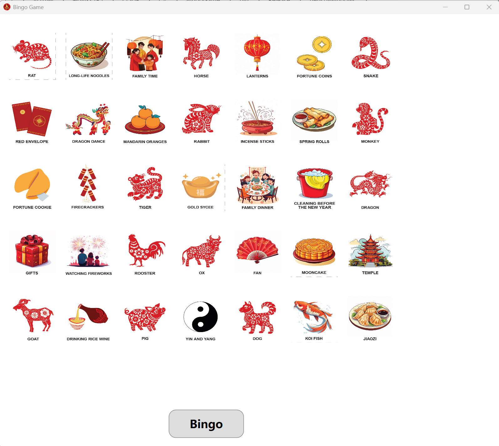

# Bingo-Game
Bingo Program implementation via C#<br/>
带有中国元素的***Bingo***游戏<br/>
Only Windows OS<br/>



## Prerequisite
> .Net SDK (I use .Net 8.0.112)<br>
> WPF Framework<br>

## Features
1. Use pseudo-random numbers to simulate drawing lots(抓阄).<br />
2. Very user-friendly UI<br />
3. Delete the number/item in array and Mask the image<br />
4. Show dialog - The current bingo item<br />
5. Backgeound music playing in the background<br />

## Download
Please see the recent release

## Get Start
Enter project directory<br>
```shell
cd ./BingoGame
```
run the project<br>
```shell
dotnet build  # build the executable
dotnet run  # run the file - you can skip the first line
```
Or you can run the executable directly

## Using
Download the release file and click BingoGame.exe executable to run it

## Contributor
- 民乐合奏《金蛇狂舞》晚会喜庆背景 中国广播民族乐团 (./resources/Media/jskw.mp3)<br/>[民乐合奏《金蛇狂舞》](https://www.bilibili.com/video/BV1qkDAYzELJ/)
- Bingo Music ( ./resources/Media/bingo.mp3 )<br>License: Creative Commons Zero<br>[对勾，答对——综艺 许可:CC0 作者:自树 来源:耳聆网 https://www.ear0.com/sound/36966](https://www.ear0.com/sound/show/soundid-36966)
